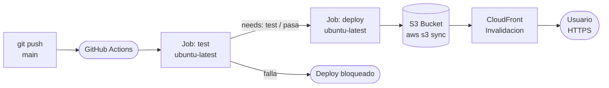

# GitHub Actions Showcase


---

## Que es esto?

Una landing page que explica GitHub Actions de forma visual e interactiva. El punto central es que el showcase es el pipeline mismo: el sitio se despliega automaticamente en AWS S3 + CloudFront cada vez que hay un `git push` a `main`, usando exactamente el workflow que el sitio explica. Es un sitio 100% estatico generado con `npm run build`.

---

## Stack

| Capa | Tecnologia |
|------|-----------|
| Frontend |   |
| Animaciones |  |
| CI/CD |  |
| Hosting |  Static Website |
| CDN |  HTTPS |
| IaC |  v4.67 |

---

## Arquitectura del pipeline



El job `deploy` solo se ejecuta si `test` termina con exito y si el evento es un `push` a `main` (no en pull requests).

---

## Estructura del proyecto

```
github-actions-showcase/
├── .github/
│   └── workflows/
│       └── deploy.yml          # Pipeline CI/CD principal
├── scripts/
│   └── setup-infra.sh          # Provisiona AWS y sube secrets a GitHub
├── src/
│   ├── components/
│   │   ├── Nav.jsx             # Barra de navegacion fija con blur
│   │   ├── CodeBlock.jsx       # Bloque de codigo con syntax highlighting manual
│   │   └── PipelineTicker.jsx  # Ticker animado del pipeline (Hero)
│   ├── sections/               # Una por seccion, en orden de aparicion
│   │   ├── Hero.jsx
│   │   ├── Eventos.jsx
│   │   ├── Yaml.jsx
│   │   ├── Secrets.jsx
│   │   ├── Pruebas.jsx
│   │   ├── Marketplace.jsx
│   │   └── Deploy.jsx
│   ├── data/
│   │   ├── eventos.js          # Triggers de GitHub Actions
│   │   ├── marketplace.js      # Actions del marketplace
│   │   └── pipeline.js         # Pasos del pipeline ticker
│   ├── hooks/
│   │   └── useScrollReveal.js  # Wrapper de useInView (Framer Motion)
│   ├── App.jsx                 # Ensambla todas las secciones
│   └── index.css               # Variables CSS, reset, estilos globales
├── terraform/
│   ├── main.tf                 # S3 via AWS CLI + distribucion CloudFront
│   ├── variables.tf
│   └── outputs.tf
└── package.json
```

---

## Secciones del sitio

| Seccion | Que cubre |
|---------|-----------|
| **Hero** | Presentacion con headline animado y ticker del pipeline en tiempo real |
| **Eventos** | Los cuatro triggers principales: `push`, `pull_request`, `schedule`, `workflow_dispatch` |
| **Workflows YAML** | El `deploy.yml` completo con anotaciones interactivas por bloque (sticky scroll) |
| **Secrets** | Como cifrar credenciales en GitHub y usarlas en el workflow sin exponerlas |
| **Pruebas** | Tests como gate de calidad: comparativa visual entre pipeline verde y rojo |
| **Marketplace** | Las actions mas usadas: `checkout`, `setup-node`, credenciales AWS, Docker, CodeQL |
| **Deploy** | El flujo completo push -> S3 -> CloudFront y la run card del workflow real |

---

## Infraestructura AWS

### S3 Bucket

Bucket con static website hosting habilitado y bucket policy publica (`s3:GetObject` para `*`). Se provisiona via AWS CLI dentro de un `null_resource` de Terraform, no con el recurso `aws_s3_bucket` nativo, porque el sandbox de AWS Academy tiene un `Deny` explicito sobre `s3:GetBucketObjectLockConfiguration` que rompe el provider v5 de Terraform.

### CloudFront Distribution

Distribucion con el endpoint HTTP del bucket como origin (`http-only`), redirect HTTP a HTTPS, y una regla `custom_error_response` que devuelve `index.html` con codigo 200 para cualquier 404. Esto permite que la navegacion por anclas funcione correctamente sin errores en rutas directas.

### Restriccion del sandbox

El sandbox de AWS Academy usa credenciales temporales con permisos IAM restringidos. Por eso:

- Se usa bucket policy en lugar de OAC/OAI (requeriria permisos sobre CloudFront origins).
- Las credenciales se pasan como variables de entorno a nivel de job (`env:`) en lugar de usar la action `aws-actions/configure-aws-credentials`, que no admite `AWS_SESSION_TOKEN` de forma directa en versiones recientes.

---

## Como desplegar (sesion nueva del sandbox)

### Prerrequisitos

- Node.js 20+ instalado (`node -v`)
- Terraform instalado (`terraform -v`)
- AWS CLI instalado (`aws --version`)
- GitHub CLI instalado y autenticado (`gh auth login`)
- Credenciales del sandbox a mano: Access Key ID, Secret Access Key, Session Token

### Pasos

**1. Clonar e instalar dependencias**

```bash
git clone https://github.com/Melo088/github-actions-showcase.git
cd github-actions-showcase
npm install
```

Verificar que el sitio corre localmente antes de desplegar:

```bash
npm run dev
# http://localhost:5173
```

**2. Autenticar GitHub CLI**

Si es la primera vez en esta maquina:

```bash
gh auth login
# Elegir: GitHub.com → HTTPS → Login with a web browser
```

Verificar que el CLI tiene acceso al repo:

```bash
gh repo view Melo088/github-actions-showcase
```

**3. Levantar infraestructura y configurar secrets**

```bash
chmod +x scripts/setup-infra.sh
./scripts/setup-infra.sh
```

El script pide las credenciales AWS del sandbox interactivamente, levanta el bucket S3 y la distribucion CloudFront con Terraform, y sube los 6 secrets al repositorio de GitHub automaticamente. Al finalizar muestra la URL del sitio.

Si es la primera vez corriendo Terraform en este directorio (o se borro el lock file):

```bash
cd terraform
terraform init
cd ..
```

**4. Disparar el primer deploy**

```bash
git push origin main
```

El workflow corre el job `test` y luego el job `deploy`. Se puede seguir el progreso en:

```
https://github.com/Melo088/github-actions-showcase/actions
```

> CloudFront puede tardar entre 5 y 15 minutos en propagar la primera vez. El sitio queda disponible en la URL que mostro `setup-infra.sh`.

**5. Desarrollo local con cambios**

Para iterar localmente y luego publicar:

```bash
npm run dev          # servidor local en http://localhost:5173
npm run build        # genera dist/ (lo mismo que hace el workflow)
npm run preview      # previsualiza el build estatico en http://localhost:4173
git add .
git commit -m "feat: descripcion del cambio"
git push origin main # dispara el workflow automaticamente
```

**6. Al terminar la sesion: destruir la infraestructura**

```bash
chmod +x scripts/destroy-infra.sh
./scripts/destroy-infra.sh
```

El script captura el ID de CloudFront desde el state de Terraform, pide confirmacion, corre `terraform destroy` y tiene un fallback via AWS CLI por si Terraform falla con la distribucion CloudFront.

> **Importante:** siempre destruir antes de que expiren las credenciales del sandbox. Una vez que expiran, no es posible limpiar los recursos y pueden generar cargos.

---

## Secrets requeridos

El script `setup-infra.sh` configura todos estos automaticamente. Si se necesita hacerlo manual: Settings -> Secrets and variables -> Actions.

| Secret | Descripcion | Origen |
|--------|------------|--------|
| `AWS_ACCESS_KEY_ID` | Credencial de acceso AWS | Sandbox -> AWS Details |
| `AWS_SECRET_ACCESS_KEY` | Clave secreta AWS | Sandbox -> AWS Details |
| `AWS_SESSION_TOKEN` | Token de sesion temporal | Sandbox -> AWS Details |
| `AWS_REGION` | Region AWS | `us-east-1` (fijo) |
| `S3_BUCKET_NAME` | Nombre del bucket S3 | Output de Terraform |
| `CLOUDFRONT_DIST_ID` | ID de la distribucion CloudFront | Output de Terraform |

---

## Capturas de pantalla

### Sitio desplegado
<!-- SCREENSHOT: pagina completa del sitio en produccion -->
> Pendiente agregar captura

### Pipeline en GitHub Actions
<!-- SCREENSHOT: pestana Actions mostrando un run exitoso con los dos jobs -->
> Pendiente agregar captura

### Infraestructura Terraform
<!-- SCREENSHOT: output de terraform apply con los recursos creados -->
> Pendiente agregar captura

---

## Integrantes

- Juan Camilo Melo Lopez
- Esteban Guarin Valencia
